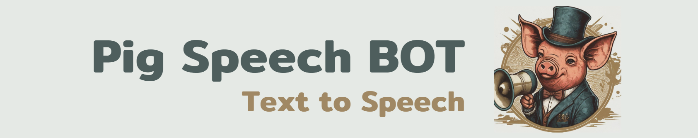

## 🐷 Pig Speech: A Text-to-Speech Discord Bot with Global Language Support 🌍

Welcome to **Pig Speech**, the **ultimate Text-to-Speech experience** for Discord! Our bot elevates communication in your server by transforming text into **natural, lifelike speech**. Whether it's a **casual chat, professional meeting,** or a **community event**, Pig Speech ensures **every message is heard loud and clear**. 🗣️✨

## 🌟 **Why Choose Pig Speech?**  

### :one: **High-Quality, Natural Voices** 🎙️  
- Powered by **gTTS (Google Text-to-Speech)**
- Enjoy **clean, understandable speech** in multiple languages
- Perfect for **engaging conversations** and **quick communication**

### :two: **Effortless Integration via Commands** 💻  
- No complex interface! Control the bot using **simple Discord commands**
- Minimal setup and **easy for both admins and members** to use
- Works directly in your **server channels** with no interruptions

### :three: **Multi-Language Support** 🌐 
- Communicate with users from **around the world**
- Supports **many languages** available through **Google TTS**

## 🚀 Get Started Today!
### 🔗 **Try the Bot on Top.gg**  
  

### 🤖 **Invite Pig Speech to Your Server**  
  

## 📜 **License**  
This project is released under the [MIT License](LICENSE). Feel free to use, modify, and share Pig Speech to improve your community’s experience.

  
